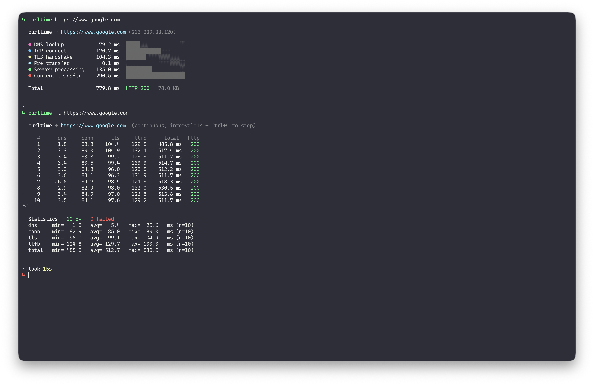

# curltime



A little wrapper around `curl` that tells you where the time actually went —
DNS, TCP, TLS, server, transfer — instead of just spitting out one total
number. There's also a ping-like mode for when you want to watch an endpoint
over time.

```
  curltime → https://example.com (93.184.216.34)
  ────────────────────────────────────────────────────────────
  ● DNS lookup             3.1 ms  ░░░░░░░░░░░░░░░░░░░░
  ● TCP connect           12.4 ms  █░░░░░░░░░░░░░░░░░░░
  ● TLS handshake         48.2 ms  ████░░░░░░░░░░░░░░░░
  ● Pre-transfer           0.4 ms  ░░░░░░░░░░░░░░░░░░░░
  ● Server processing    231.0 ms  ████████████████████
  ● Content transfer       1.8 ms  ░░░░░░░░░░░░░░░░░░░░
  ────────────────────────────────────────────────────────────
  Total                  296.9 ms  HTTP 200   1.2 KB
```

Runs anywhere you've got bash, awk, and a reasonably recent `curl`. That's
it — no other dependencies, no install dance for libraries.

## Install

One-liner:

```sh
curl -fsSL https://raw.githubusercontent.com/arastu/curltime/main/install.sh | bash
```

The installer drops the script into the first writable directory it finds
out of `/usr/local/bin` and `~/.local/bin`. If you want it somewhere else,
set `CURLTIME_PREFIX=/wherever`.

Or just grab the file yourself:

```sh
sudo curl -fsSL https://raw.githubusercontent.com/arastu/curltime/main/curltime \
  -o /usr/local/bin/curltime
sudo chmod +x /usr/local/bin/curltime
```

## Usage

Use it the same way you'd use `curl` — swap the name and you're done:

```sh
curltime https://google.com
curltime -H 'Authorization: Bearer …' https://api.example.com/me
curltime -X POST -d '{"a":1}' -H 'content-type: application/json' https://api/x
```

Every flag `curltime` doesn't recognise gets passed straight through to curl.

### Repeating, ping-style

```sh
curltime -n 10 https://example.com           # 10 requests
curltime -n 20 -i 0.5 https://example.com    # every 0.5s
curltime -t  https://example.com             # forever, until Ctrl+C
```

What that looks like:

```
  curltime → https://example.com  (count=5, interval=1s)
  ────────────────────────────────────────────────────────────
     #      dns     conn      tls     ttfb      total   http
     1      3.5      0.2     48.1     31.2      82.9 ms   200
     2      3.2      0.2     46.3     28.7      78.5 ms   200
     ...
  ────────────────────────────────────────────────────────────
  Statistics   5 ok   0 failed
  dns     min=   3.2   avg=   3.3   max=   3.5   ms (n=5)
  conn    min=   0.2   avg=   0.3   max=   0.4   ms (n=5)
  tls     min=  46.3   avg=  47.5   max=  49.1   ms (n=5)
  ttfb    min=  28.7   avg=  30.0   max=  32.1   ms (n=5)
  total   min=  78.5   avg=  81.4   max=  83.2   ms (n=5)
```

### Flags

| Flag | What it does |
| --- | --- |
| `-n, --count N` | Run N requests. `0` means infinite. Default `1`. |
| `-i, --interval SEC` | How long to wait between requests (decimals are fine). Default `1`. |
| `-t, --continuous` | Shorthand for `--count 0`. |
| `--no-color` | Turn off colour (`NO_COLOR=1` works too). |
| `--curl PATH` | Use a specific curl binary (or set `CURLTIME_CURL=`). |
| `-h, --help` | Help. |

Anything else gets handed off to curl as-is.

### Picking a curl

By default `curltime` uses the first `curl` on your `$PATH`, falling back to
`/usr/bin/curl`. If you need a particular build:

```sh
curltime --curl /path/to/curl https://example.com
CURLTIME_CURL=/path/to/curl curltime https://example.com
```

## What each phase actually means

| Phase | Where it comes from |
| --- | --- |
| DNS lookup | `time_namelookup` |
| TCP connect | `time_connect − time_namelookup` |
| TLS handshake | `time_appconnect − time_connect` (zero for plain HTTP) |
| Pre-transfer | `time_pretransfer − time_appconnect` |
| Server processing | `time_starttransfer − time_pretransfer` — this is your TTFB |
| Content transfer | `time_total − time_starttransfer` |
